# Farligt avfall – mockuper för granskning

Designförslag 2026-10-09 med fiktiva exempeldata. **Appen är oförändrad:**
bilderna visar föreslagna vyer och händelser, inga integrationer eller nya
funktioner är aktiverade. Inga kontouppgifter, certifikat eller avtal behövs
för att granska bilderna. Förslagen är ännu inte godkända för implementation.

Omfattning: **blybatterier, 16 06 01\***, vägning hos kunden med våg,
kundinlämning, JEROC-hämtning och utleverans med egen eller extern transportör.
Kontorsvyerna följer den [senaste godkända kortlayouten](../kontor/13_Invagning_Kundgodkannande_Attest_Sparbarhet.png)
med profil längst ner i vänstermenyn och lodrät spårbarhet. Prissättning,
A/B/C, kundpriser och kundgodkännande behåller sina befintliga funktioner.
JEROC Norrtäljes adress i serien är **Ångsvägen 19, 761 41 Norrtälje**
(fiktiv demoadress).

## Öppna en vy

| Nr | Bild |
| --- | --- |
| 1 | [Artikel – miljö](01_Artikel_Miljo.png) |
| 2 | [Invägning – mottagning](02_Invagning_Mottagning.png) |
| 3 | [Arbetsordrar – översikt](03_Arbetsordrar_Oversikt.png) |
| 4 | [Ny arbetsorder – hämtning](04_Ny_Arbetsorder_Hamtning.png) |
| 5 | [Arbetsorder – hämtning](05_Arbetsorder_Hamtning.png) |
| 6 | [Utleverans – extern transportör](06_Utleverans_Extern_Transportor.png) |
| 7 | [Transportdokument – A4](07_Transportdokument_A4.png) |
| 8 | [Mobil – chaufför och lämnare](08_Mobil_Chauffor_Och_Lamnare.png) |
| 9 | [Miljörapportering – översikt](09_Miljorapportering_Oversikt.png) |
| 10 | [Miljörapport – rättelse](10_Miljorapport_Detalj_Rattelse.png) |
| 11 | [Anläggning – tillstånd](11_Anlaggning_Tillstand.png) |

[Transportdokument som A4-PDF](07_Transportdokument_A4.pdf) ·
[Flöden och interaktioner](Floden.txt)

## 1. Artikel – Miljö & avfallsklassificering

[Öppna bilden](01_Artikel_Miljo.png)

Ett nytt miljökort ligger under grunduppgifter och referensbilder. Valen är
Icke-farligt/Farligt avfall; vid farligt visas kod, miljöbeskrivning och
hanteringsinstruktioner direkt. Blybatterier visar **16 06 01\***. ADR-bedömning
hålls separat från avfallsklassificeringen. Prisrutor och volymgränser behålls.

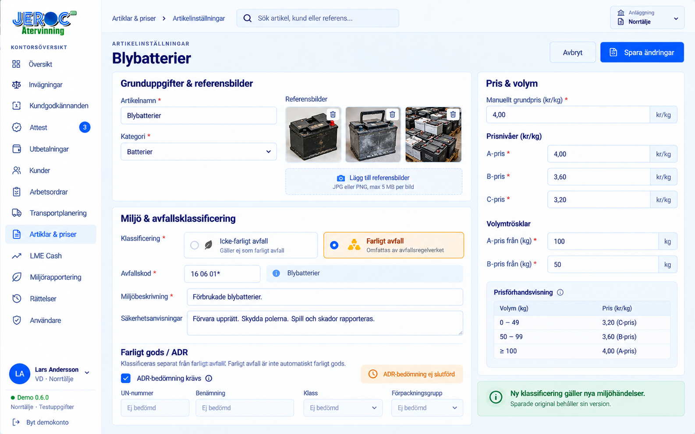

## 2. Invägning – faktisk mottagning

[Öppna bilden](02_Invagning_Mottagning.png)

**INV-2050** är en direkt kundinlämning med 250 kg blybatterier och en separat
rad med 12 kg koppar. Den har ingen intern arbetsorder.
Miljöpanelen gäller batteriraden och innehåller tidigare innehavare,
ursprungsplats, faktisk mottagning, transportsätt och inkommande dokument.
Kundens fakturaadress ersätter inte ursprungsadressen. Dokument saknas öppnar
en avvikelse; det skapar inget bakdaterat transportdokument. Saknat dokument
ensamt blockerar inte rapportering om de obligatoriska mottagningsuppgifterna
är kompletta. Kunden lämnar senare originalet **TD-IN-2050**, som länkas
kl. 10:55. Miljöstatus kan gå vidare medan kundgodkännande och ekonomi väntar.

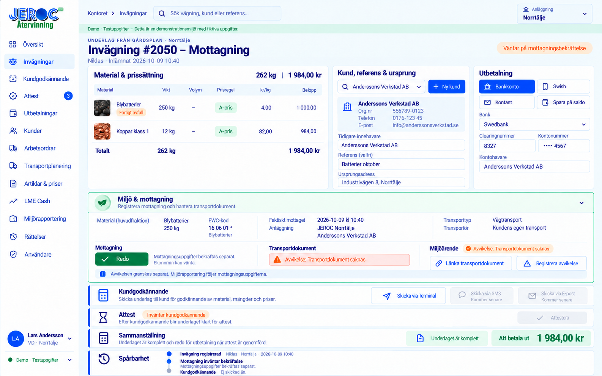

## 3. Arbetsordrar – egen översikt

[Öppna bilden](03_Arbetsordrar_Oversikt.png)

**Arbetsordrar** får en egen huvudmeny. Sökning och filter skiljer bland annat
hämtning, byte och utleverans samt egen/extern transportör. Klick på en rad
öppnar ordern; Planera öppnar befintlig Transportplanering med samma order.
Det skapas ingen separat orderlista vid sidan av planeraren.

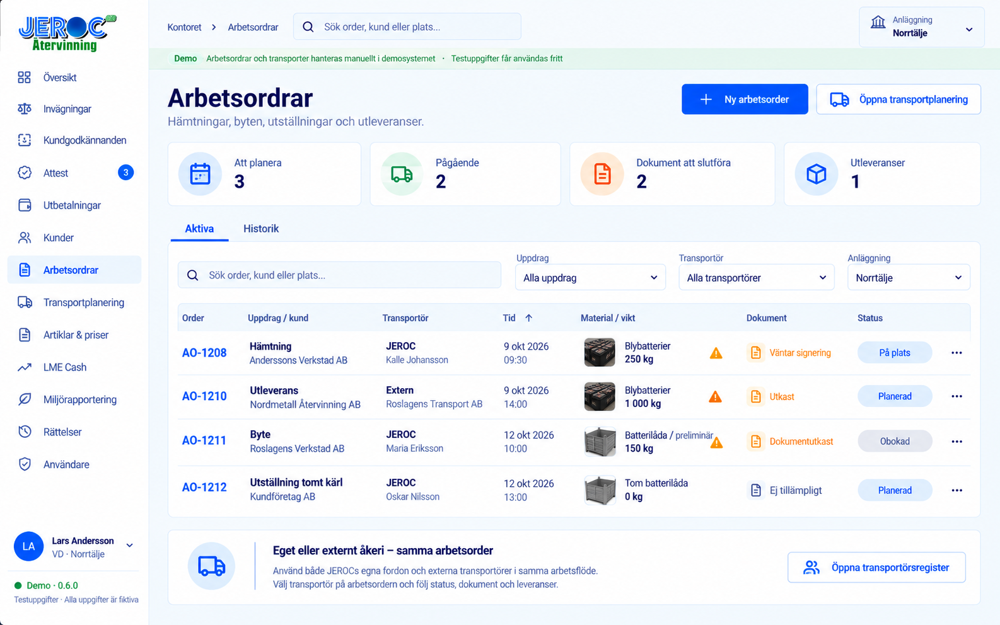

## 4. Ny arbetsorder – hämtning

[Öppna bilden](04_Ny_Arbetsorder_Hamtning.png)

Formuläret visar hämtning av blybatterier hos Anderssons Verkstad AB,
Industrivägen 8, Norrtälje, till JEROC Norrtälje. Det visar fält för hämtning:
platser, material, preliminär vikt, kärl, kontakt och förare/fordon eller extern
transportör. Bilden illustrerar alternativet extern transportör; detaljen
i nästa bild visar en egen JEROC-körning. Spara skapar ett transportdokumentutkast.
Den faktiska vikten fastställs med våg hos kunden före avfärd med last.

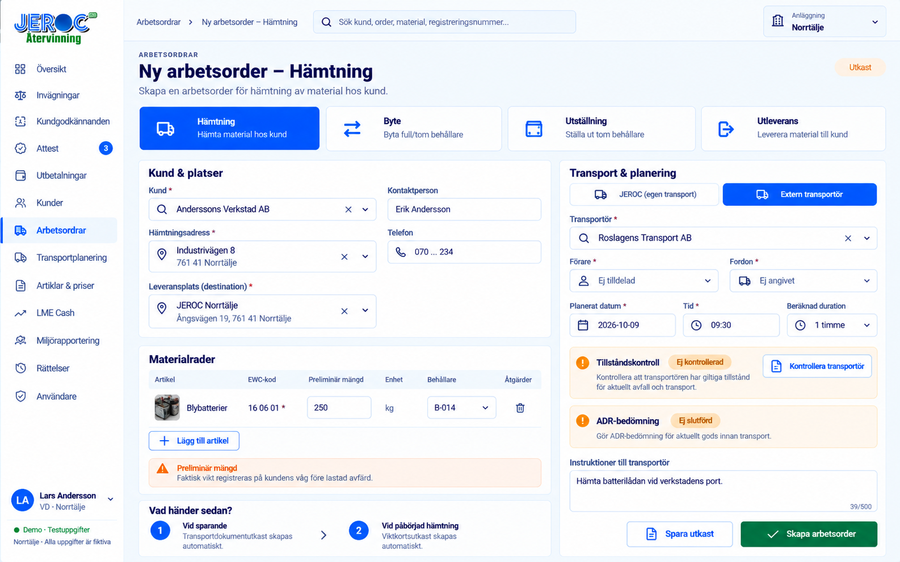

## 5. Arbetsorder – hämtningens steg

[Öppna bilden](05_Arbetsorder_Hamtning.png)

**AO-1208 → TD-1208 → INV-2052** är en separat egen hämtning av 250 kg
blybatterier. Orderns Översikt och Transportdokument visar samma uppdrag.
På väg till kund
startar uppdraget och länkar ett viktkortsutkast; det betyder inte att bilen
kör med batterier. Efter vägning, fullständigt dokument och rätt underskrifter
kan **Avfärd med last** dokumenteras. Faktisk mottagning registreras separat
vid rätt tid och plats. Den kan ske hos kunden beroende på faktiskt övertagande
och verksamhetsroll; mottagningstid är inte automatiskt tiden för vägning på
JEROC. Order, dokument, viktkort och miljöposter är länkade.

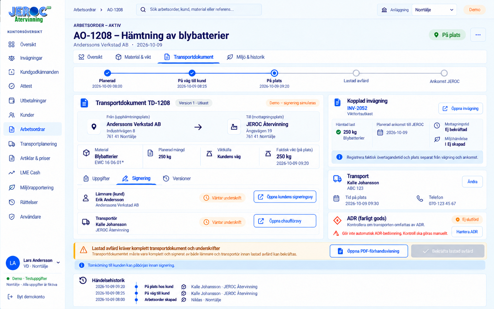

## 6. Utleverans – extern transportör

[Öppna bilden](06_Utleverans_Extern_Transportor.png)

**AO-1210 / TD-1210:** JEROC lämnar 1 000 kg lagrade blybatterier till
Nordmetall Återvinning AB. Roslagens Transport AB är extern transportör.
Utleveransen visar ursprungsanläggning, mottagare, transportör, fordon,
lagerpartier och faktisk lastvikt. Dokument och borttransportanteckning
färdigställs före lastad avfärd. Bekräftad avfärd registrerar den faktiska
avfärdstiden och gör lageravdrag en gång för den faktiska lasten.

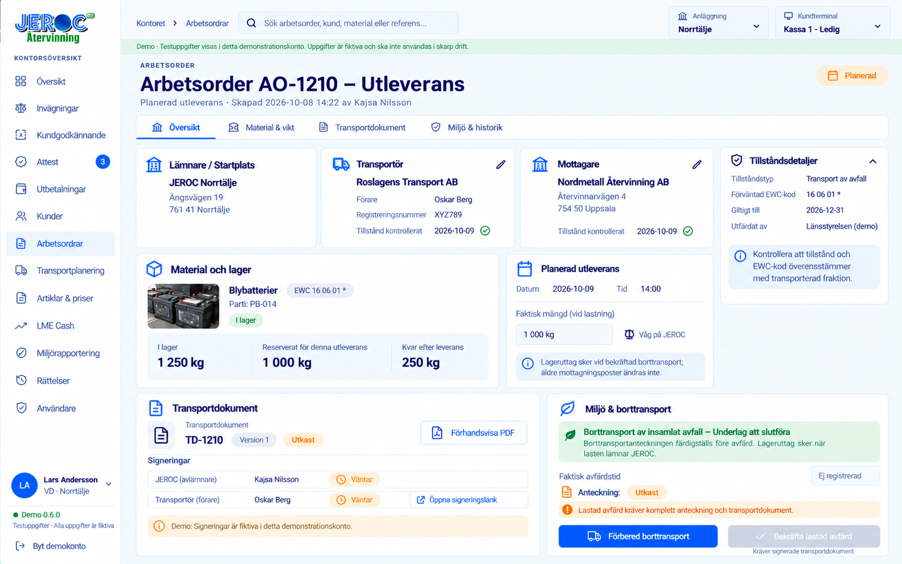

## 7. Transportdokument – A4

[Öppna bilden](07_Transportdokument_A4.png) ·
[Öppna A4-PDF](07_Transportdokument_A4.pdf)

Dokumentet samlar lämnare, transportör, slutlig mottagare, start/destination,
avfallskod, vikt och starttid. TD-1208 gäller den egna hämtningens 250 kg
blybatterier. Dokumentversion och underskrifter hör ihop; en ändring kräver
en ny version. **DEMO / SIMULERAD** signering är tydlig och är ingen riktig
elektronisk underskrift. Transportdokumentet är inte en avräkningsnota eller
en bekräftelse från Avfallsregistret.

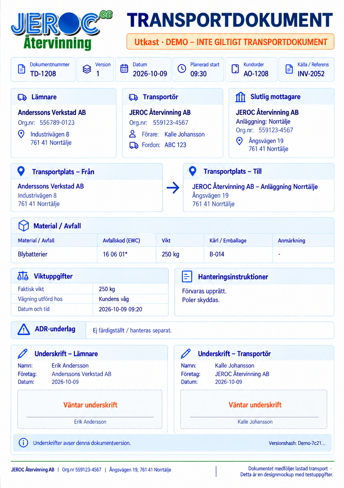

## 8. Mobil – chaufför och lämnare

[Öppna bilden](08_Mobil_Chauffor_Och_Lamnare.png)

En mobilanpassad webbvy ger chauffören order, vägning på plats, dokument och
transportsteg. Lämnaren granskar samma dokumentversion i sin egen vy.
Underskrifterna visas som **SIMULERADE** i mockupen. Chauffören dokumenterar
250 kg från vågen före lastad avfärd. Gårdsappens material- och viktflöde
behåller sin enkla utformning.

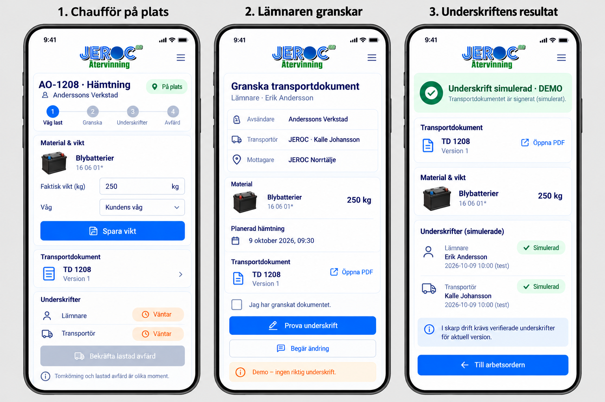

## 9. Miljörapportering – arbetskö

[Öppna bilden](09_Miljorapportering_Oversikt.png)

En egen kö visar mottagning och borttransport med anläggning, frister,
avfallskod, mängd och status. Sök/filter och varningar hjälper miljöansvarig
att hitta saknade uppgifter, fel och rättelser. Rapporteringen väntar inte
på kundgodkännande, attest eller betalning. Avfalls-ID i demo är uttryckligen
**SIMULERAT**; bilderna visar ingen verklig myndighetsanslutning. Fliken
Aktiva visar fem aktuella batteriposter. Simulerat rapporterade poster visas
under Historik. Tillgänglig anslutning och demo/testläge framgår separat.

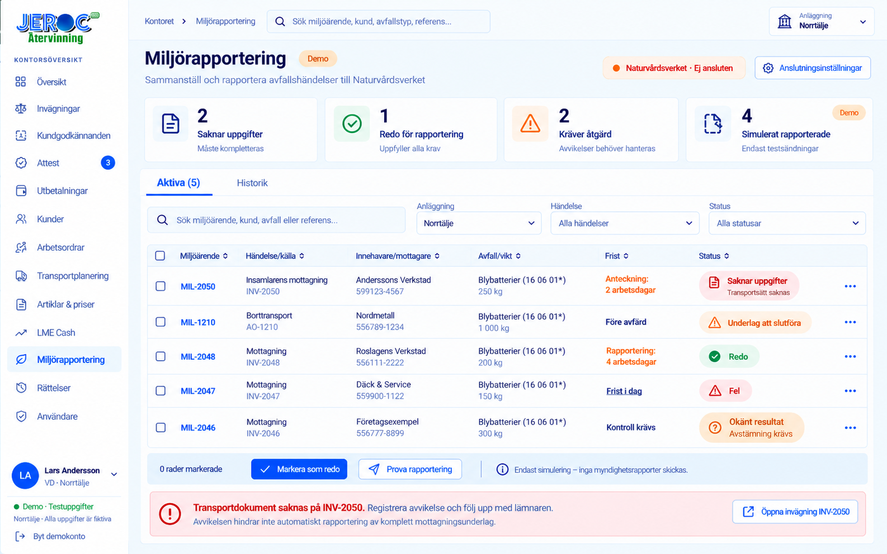

## 10. Miljörapport – detaljer och rättelse

[Öppna bilden](10_Miljorapport_Detalj_Rattelse.png)

**MIL-2050** hör till den direkta kundinlämningen INV-2050 och illustrerar
rättelse från 250 till 245 kg batterier. Detaljen visar underlaget,
verksamhetsrollen, dokumentversionen, försök och historiken. En fysisk
viktavvikelse kan kräva lager- och miljörättelse; en
ren prisändring påverkar ekonomin. Tidigare rapportversioner sparas. Ett
okänt API-resultat ska först stämmas av innan nytt försök, så att samma
händelse inte rapporteras dubbelt. Även lyckade svar och ID är markerade
**SIMULERADE** i denna designserie.

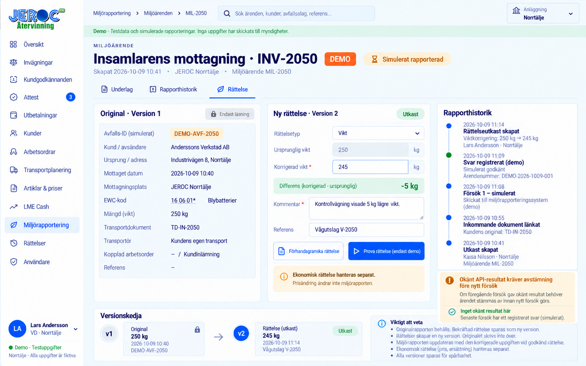

## 11. Anläggning – tillstånd och mängdgränser

[Öppna bilden](11_Anlaggning_Tillstand.png)

Anläggningens tillåtna avfallskoder, lagermängder och gränser visas tillsammans
med regler för varning eller stopp. Externa transportörer och mottagare
behöver sina relevanta tillstånd kontrollerade. ADR visas som en separat
bedömning. Exempelgränser i bilden är demo och ersätter inget tillstånd.
Behörighetsraderna för Kajsa och Kalle är individuella och gäller vald
anläggning. Själva tilldelningen görs under **Användare**.

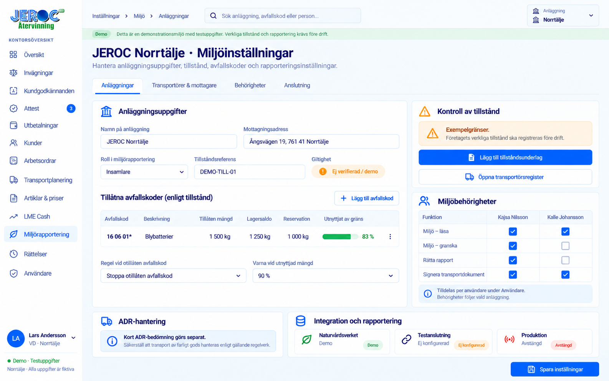

[Läs de föreslagna flödena och interaktionerna](Floden.txt).
