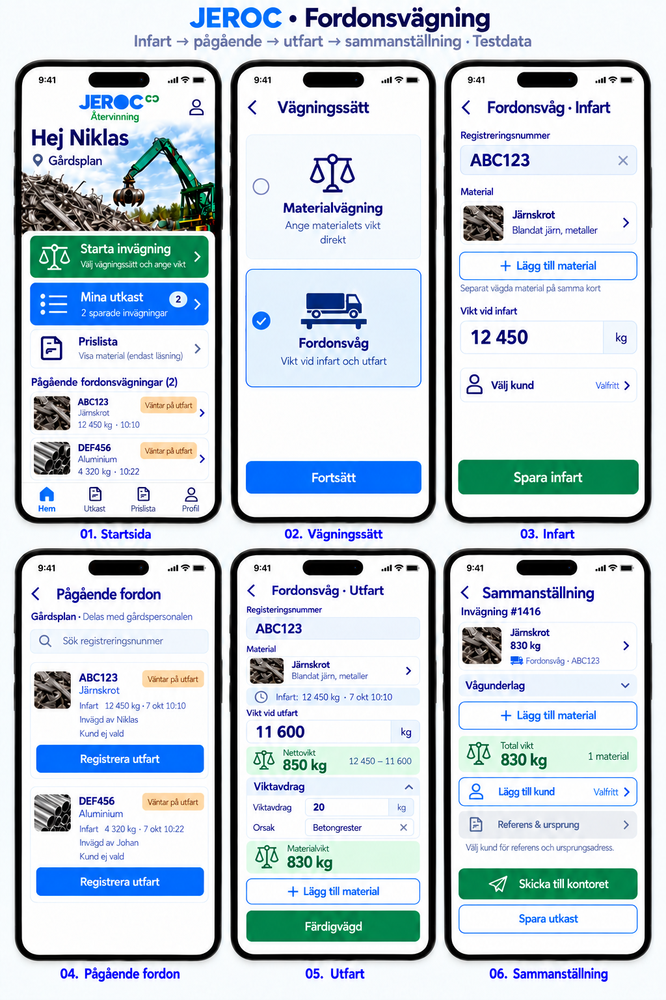
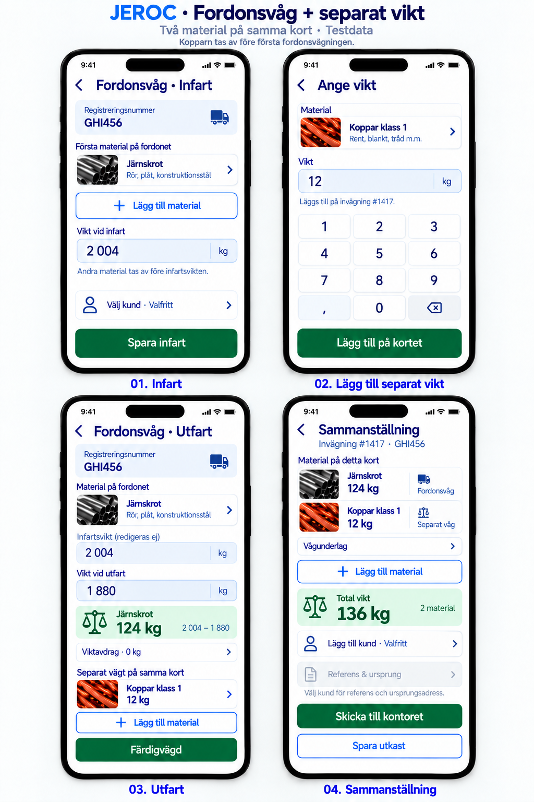
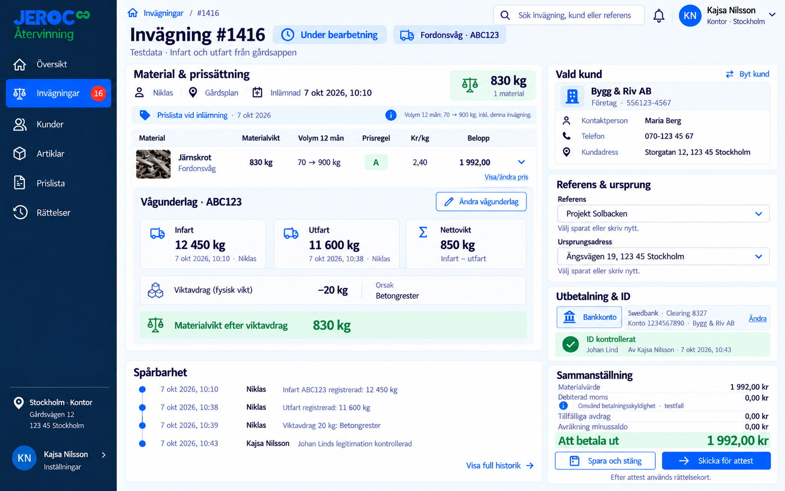
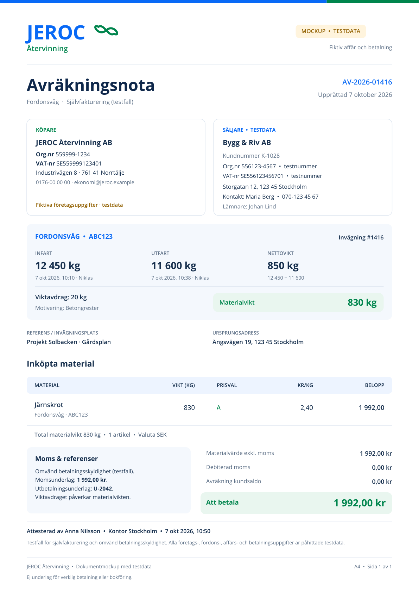

# Fordonsvägning – mockuper

Mobilflöden för fordonsvåg, kontorets vågunderlag och en avräkningsnota i A4. Alla företags-, fordons- och affärsuppgifter är testdata.

| Mockup | Öppna |
| --- | --- |
| Mobil: infart, pågående fordon, utfart och sammanställning | [Bild](01_Mobil_Fordonsvag.png) |
| Mobil: fordonsvåg och separat vägt material på samma kort | [Bild](02_Mobil_Blandad_Last.png) |
| Kontor: materialpris och spårbart vågunderlag | [Bild](03_Kontor_Vagunderlag.png) |
| Avräkningsnota för fordonsvägning | [A4-PDF](04_Avrakningsnota_Fordonsvag_A4.pdf) · [Förhandsvisning](04_Avrakningsnota_Fordonsvag_A4.png) |

## Normal last

Fordonsvägning #1416, ABC123. Infart 12 450 kg den 7 oktober 2026 kl. 10:10, utfart 11 600 kg kl. 10:38. Nettovikten är 850 kg. Viktavdrag 20 kg för betongrester ger 830 kg järnskrot. Kontorets exempelpris är 2,40 kr/kg, vilket ger 1 992,00 kr.

Vägaren väljer material med den befintliga materialväljaren. **Lägg till material** öppnar samma materialval och vanliga viktfält för ytterligare, separat vägda artiklar på samma kort. Knappen finns vid infart, utfart och i sammanställningen. Pågående fordonsvägningar delas med gårdspersonalen. Kunden är valfri när vägningen skickas till kontoret; referens och ursprungsadress kan anges först när kunden är vald. Gårdsappen visar vikter. Kontoret hanterar priser, ID-kontroll och överlämning till attest.

## Fordonsvåg och separat vikt

Vägaren tittar på lasten och tar av andra material före första fordonsvägningen. I exemplet tas 12 kg koppar klass 1 av släpet, vägs på en vanlig våg och läggs till som en egen materialrad på samma kort. Registreringen av den separata vikten kan göras vid infart, utfart eller i sammanställningen; kopparn ska fysiskt vara borttagen när infartsvikten tas.

Fordonsvägning #1417, GHI456. Infartsvikt med bara järnskrotet kvar: 2 004 kg. Utfartsvikt efter lossning: 1 880 kg. Fordonsvågens differens ger 124 kg järnskrot. Materialraderna summeras till **124 + 12 = 136 kg**. Varje rad visar sin vägningsmetod och sitt underlag. Den separata kopparvikten dras inte av från fordonsdifferensen, eftersom kopparn redan är borttagen före infartsvikten. MVP-flödet behöver därför ingen mellanvägning eller automatisk fördelning av vikter.

## Kontorets underlag

Fordonsvägda artikelrader visar registreringsnummer, infart, utfart, nettovikt, viktavdrag med motivering och materialvikt. Kontoret kan ändra vågunderlaget före attest, med historik. Efter attest används rättelsekort. Volymen i prisberäkningen baseras på materialvikten efter viktavdrag och kundens senaste tolv månader per artikel.

## Avräkningsnota

En sida stående A4 med samma fordonsuppgifter och beräkning som normalflödet. Dokumentet visar ett testfall för självfakturering och omvänd betalningsskyldighet.

[Öppna avräkningsnotan som PDF](04_Avrakningsnota_Fordonsvag_A4.pdf)

