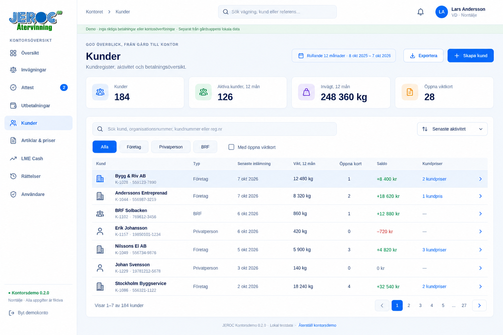
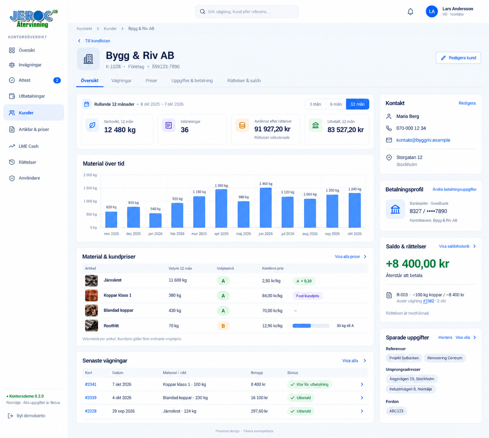
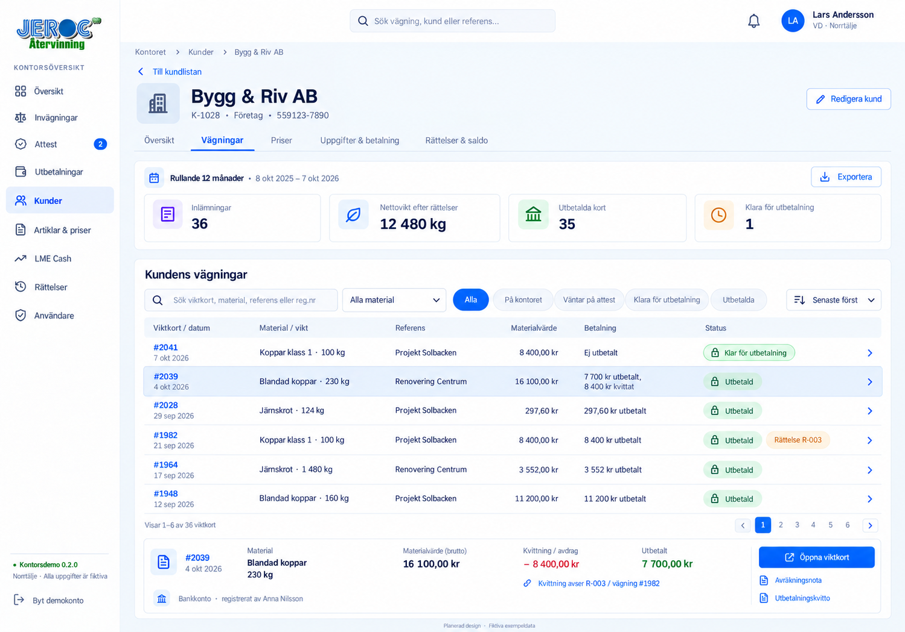
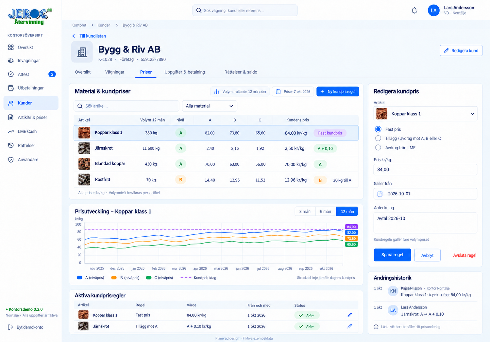
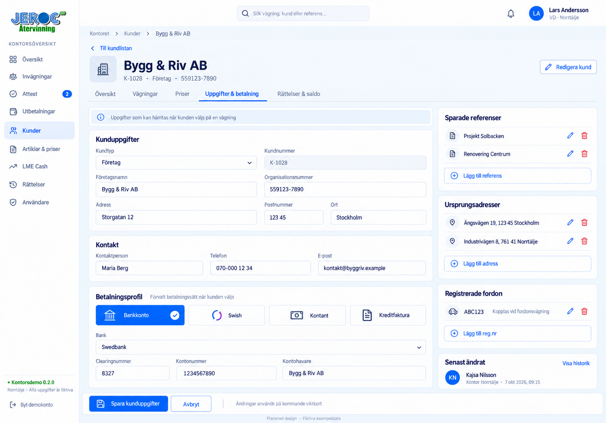
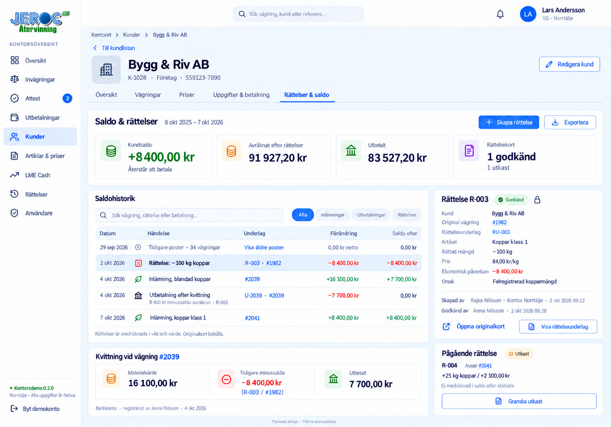
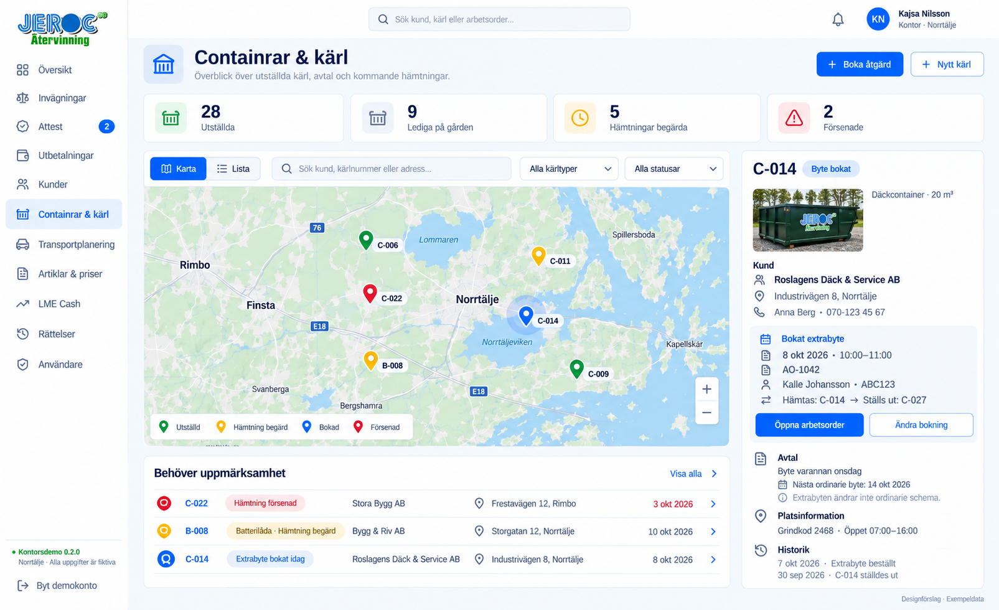
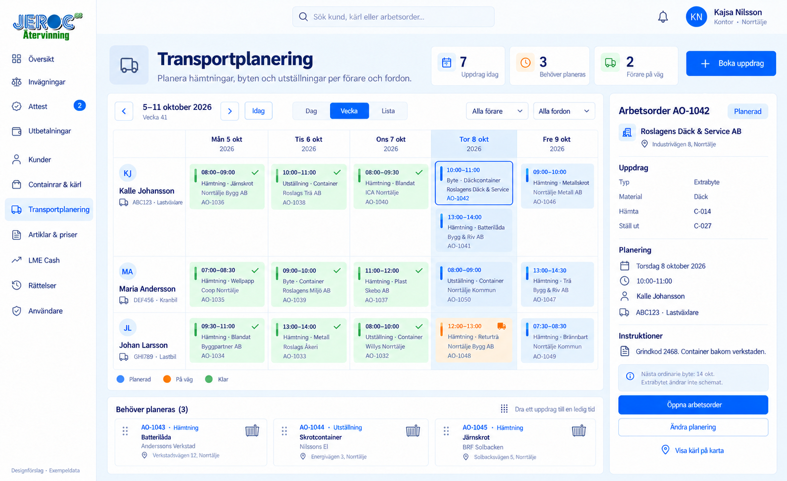

# Kontorswebben – mockuper

Designbilder med fiktiva exempeldata, framtagna 2026-10-07. Uppladdning av
mockuper ändrar inte appen och aktiverar inga betalningar eller integrationer.

## Betalningsuppgifter på invägningskortet

[Öppna mockup](01_Invagning_Betalningssatt.png)

Godkänd design för ÄL 023: Bankkonto, Swish, Kontant och Kreditfaktura som
kompakta val med metodens inmatningsfält direkt under. Gemensam manuell
ID-kontroll ligger kvar. Rutan används när invägningskortet kompletteras före
attest.

## Kundlista – godkänd mockup

[Öppna kundlistan](02_Kundlista.png)

- Sök namn, organisationsnummer, kundnummer eller registreringsnummer.
- Filtrera kundtyp och öppna viktkort; sortera efter senaste aktivitet.
- Visa senaste inlämning, vikt under rullande 12 månader, öppna viktkort,
  saldo och antal kundanpassade prisregler.
- Hela kundraden öppnar kundkortet. Kunden får ingen gemensam A/B/C-nivå;
  prisnivå beräknas separat för varje artikel.

## Kundkort, Översikt – godkänd mockup

[Öppna kundkortet](03_Kundkort_Oversikt.png)

- Flikar: Översikt, Vägningar, Priser, Uppgifter & betalning samt Rättelser & saldo.
- Översikt med rullande tolvmånadersperiod, nettovikt, antal inlämningar,
  avräknat värde efter rättelser, utbetalt och månadsgraf över invägd vikt.
- Per artikel: volym under perioden, A/B/C-nivå, faktiskt kundpris och
  nästa volymgräns. Kundanpassade regler går före ordinarie volympris.
- Senaste viktkort med länk och aktuell status; kontakt, betalningsprofil,
  sparade referenser, ursprungsadresser och registrerade fordon i sidokolumnen.
- Saldo och rättelse med länk till originalvägningen. I exemplet är rättelsen
  redan inkluderad: 91 927,20 kr avräknat minus 83 527,20 kr utbetalt ger
  +8 400,00 kr kvar att betala. Rättelsen ska inte dras av en gång till.

## Kundkortets fem flikar

Samma kund och exempeldata används genom hela serien. **Kunder** är markerad
i huvudmenyn, och kundens fem flikar ligger kvar när innehållet byts.

| Flik | Mockup | Designstatus |
| --- | --- | --- |
| Översikt | [03_Kundkort_Oversikt.png](03_Kundkort_Oversikt.png) | Godkänd |
| Vägningar | [04_Kundkort_Vagningar.png](04_Kundkort_Vagningar.png) | För granskning |
| Priser | [05_Kundkort_Priser.png](05_Kundkort_Priser.png) | För granskning |
| Uppgifter & betalning | [06_Kundkort_Uppgifter_Betalning.png](06_Kundkort_Uppgifter_Betalning.png) | För granskning |
| Rättelser & saldo | [07_Kundkort_Rattelser_Saldo.png](07_Kundkort_Rattelser_Saldo.png) | För granskning |

### Vägningar

[Öppna Vägningar](04_Kundkort_Vagningar.png)

Kundens viktkort med sökning, material- och statusfilter, datum, vikt,
referens, materialvärde och betalning. Vald vägning visar även kvittat belopp
och länkar till underlag. Originalkortet behåller sin historik och märks med
länk till rättelsen; en rättelse skriver inte över den ursprungliga vägningen.

### Priser

[Öppna Priser](05_Kundkort_Priser.png)

Volym under rullande 12 månader och A/B/C-nivå visas per artikel, med
jämförelse mellan ordinarie pris och kundens faktiska pris. Kundregler kan
vara fastpris, tillägg eller avdrag mot en prislista, eller eget avdrag från
LME. Kundregeln gäller före volympriset. Pristrend och regelhistorik visar
prisernas utveckling; ändrade regler räknar inte om låsta underlag.
Den streckade linjen visar dagens kundpris som jämförelse, inte kundens
historiska prisutveckling.

### Uppgifter & betalning

[Öppna Uppgifter & betalning](06_Kundkort_Uppgifter_Betalning.png)

Kund- och kontaktuppgifter, förvalt betalningssätt och metodens fält enligt
ÄL 023: Bankkonto, Swish, Kontant eller Kreditfaktura. Sparade referenser,
ursprungsadresser och fordon kan hanteras direkt på kundkortet. Profilen
kan hämtas när kunden väljs på en kommande vägning; tidigare låsta kort
behåller sina uppgifter. Manuell ID-kontroll görs på respektive viktkort.

### Rättelser & saldo

[Öppna Rättelser & saldo](07_Kundkort_Rattelser_Saldo.png)

Saldo, rättelsekort och saldohistorik med plus- och minusposter. En rättelse
länkas till kunden, originalvägningen och rättelseunderlaget, med person,
kontor och tidpunkt. Den korrigerade volymen hör till ursprunglig
inlämningsdag. Minus kan kvittas mot senare betalning med tydlig hänvisning;
ett positivt rättelsebelopp går vidare till attest och utbetalning.

### Gemensamma exempelbelopp

Exempelperioden är 8 oktober 2025–7 oktober 2026. De 36 inlämningarna ger
12 480 kg efter rättelser. Rättelser räknas separat från antalet inlämningar.

| Händelse | Saldoförändring | Saldo efter händelsen |
| --- | ---: | ---: |
| Tidigare 34 vägningar: 75 827,20 kr avräknat och lika mycket utbetalt | 0,00 kr kvar | 0,00 kr |
| R-003: −100 kg koppar klass 1 på vägning #1982 | −8 400,00 kr | −8 400,00 kr |
| Vägning #2039: 230 kg blandad koppar | +16 100,00 kr | +7 700,00 kr |
| U-2039: 7 700 kr utbetalt, efter kvittning av 8 400 kr | −7 700,00 kr | 0,00 kr |
| Vägning #2041: 100 kg koppar klass 1, klar för utbetalning | +8 400,00 kr | +8 400,00 kr |

Avräknat efter rättelser: **91 927,20 kr**. Utbetalt: **83 527,20 kr**.
Skillnaden är **+8 400,00 kr** kvar att betala. R-003 ingår redan i vikt,
avräknat värde och saldo och ska inte dras av en gång till. R-004 visas som
ett **utkast på +25 kg och +2 100 kr** och ingår ännu inte i dessa summor.

Kundlistan och kundkortets Översikt är godkända som designunderlag 2026-10-07
och dokumenterade i ÄL 024 som planerade ändringar. Flikarna har presenterats
i text och de fyra nya detaljmockuperna är framtagna på användarens begäran;
de väntar på designgodkännande. Ingen koduppdatering är beställd här. Fullständigt
kundkort, saldo-/rättelseflöde och kundadministration finns ännu inte i den
publicerade kontorsdemon. Vid genomförande ska statistik, kundpriser,
betalningsuppgifter och ändringsknappar följa användarens behörigheter.

Senaste byggbeslut: alla fem kundflikar är godkända. I appversion 0.3.0 ersätts mockupernas Kreditfaktura av **Spara på saldo**. Underlagen visar exempeldata; appen räknar statistik från sparade demokort.

## Containrar & kärl – designförslag 2026-10-08

[Öppna kartvyn](08_Containrar_Karl.png)

Karta med utställda containrar och kärl, sökning, typ- och statusfilter samt
växling till lista. Det valda kärlet visar kund, adress, kontakt, bokad åtgärd,
avtal, platsinformation och historik. Kärl kan hanteras individuellt med eget
nummer; flera kärl och adresser kan höra till samma kund.

Kartans färger visar läget för nästa åtgärd: grönt för utställd, gult för
hämtning begärd, blått för bokad och rött för försenad. En bokning flyttar
inte kärlet: C-014 står kvar hos kunden fram till genomfört byte, och C-027
är det reserverade ersättningskärlet. Fyllnadsgrad ska anges manuellt när
den behövs, inte presenteras som en automatisk sensormätning.

## Transportplanering – designförslag 2026-10-08

[Öppna kalendern](09_Transportplanering.png)

Veckokalender med rader för förare och fordon, val för dag/vecka/lista och
en kö med uppdrag som behöver planeras. Vald arbetsorder visar kund,
adress, åtgärd, material, kärlnummer, tid, förare, fordon och instruktioner.
Kalenderns egen statusförklaring visar Planerad, På väg och Klar.

Planeringen ska omfatta både hämtning, byte och utställning. En hämtning av
en batterilåda behöver exempelvis inte vara ett containerbyte. Återkommande
avtal och extra beställningar skapar arbetsordrar i samma planering.

### Gemensamt exempel i de två transportmockuperna

| Uppgift | Exempeldata |
| --- | --- |
| Arbetsorder | AO-1042, bokat extrabyte |
| Kund | Roslagens Däck & Service AB |
| Plats | Industrivägen 8, Norrtälje |
| Tid | Torsdag 8 oktober 2026, 10:00–11:00 |
| Förare / fordon | Kalle Johansson / ABC123, lastväxlare |
| Kärl | Hämta C-014, ställ ut C-027, däckcontainer 20 m³ |
| Ordinarie schema | Byte varannan onsdag, nästa byte 14 oktober |

Extrabyten ändrar inte det ordinarie schemat. Kartans detaljkort länkar till
arbetsordern, och arbetsordern länkar tillbaka till kärlet på kartan. Efter
genomfört byte flyttas C-027 till kunden och C-014 tas hem med historiken
bevarad. Senare kan transporten länkas till en vägning; materialets vikt
registreras när det faktiskt vägs.

De här två bilderna är för designgranskning. De innebär ingen ändring i
appen och har ännu inte lagts in som godkända byggpunkter i ÄL.
