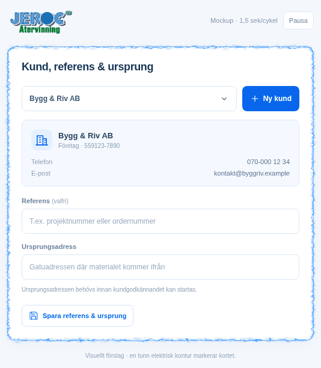

# Elektrisk kortkontur – animerad mockup

Uppdaterat förslag 2026-10-10: en sammanhängande elektrisk kontur med små
krusningar längs kanten, lugnare hörn och svagare glöd. Alla synliga linjer
följer samma slutna kontur; de separata blixtgrenarna är borttagna. JEROC-blå
färg på det befintliga vita kortet, vars innehåll ligger stilla. Efter senaste
justeringen är kanten dubbelt så tjock och hastigheten 20 % högre än
3-sekundersförslaget: 2,5 sekunder per cykel, med möjlighet att pausa.

[Öppna förhandsvisningen med pausknapp på Render](https://jeroc-atervinning.onrender.com/mockups/kortfokus-elektrisk.html)
efter nästa driftsättning. [Desktopbild](Kortfokus_Desktop.png) ·
[Mobilbild](Kortfokus_Mobil.png).

Källan ligger i [den fristående HTML-mockupen](../../../public/mockups/kortfokus-elektrisk.html).
Appens befintliga fokusmarkering är ännu oförändrad. Ingen verksamhetsdata
eller integration används i förhandsvisningen.

Kontrollerat i Chromium vid 940 och 390 pixlars bredd: ingen horisontell
överströmning eller JavaScriptfel. Minskad rörelse pausar animationen.
GIF-filen visar 50 bildrutor à 50 ms, totalt 2 500 ms per cykel.
