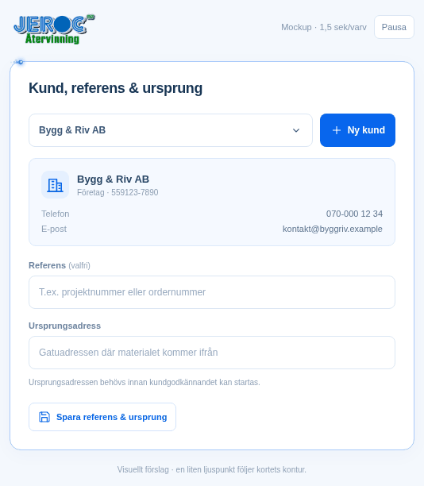

# Kortfokus med ljuspunkt – animerad mockup

Förslag 2026-10-10: en stilla blå kortkontur och en liten blå/turkos ljuspunkt
med diskret glitter som följer kanten. Ett varv tar 1,5 sekunder. Kortet
pulserar inte och får ingen ny instruktionstext.

[Öppna förhandsvisningen med pausknapp på Render](https://jeroc-atervinning.onrender.com/mockups/kortfokus-ljuspunkt.html)
efter nästa driftsättning. [Mobilbild](Kortfokus_Mobil.png).

Källan ligger i [den fristående HTML-mockupen](../../../public/mockups/kortfokus-ljuspunkt.html).
Detta är en förhandsvisning; appens befintliga fokusmarkering är inte ändrad.

Kontrollerat i Chromium vid 940 och 390 pixlars bredd: ingen horisontell
överströmning eller JavaScriptfel. Minskad rörelse pausar ljuspunkten.
GIF-filen visar 50 bildrutor à 30 ms, ett varv på totalt 1 500 ms.
