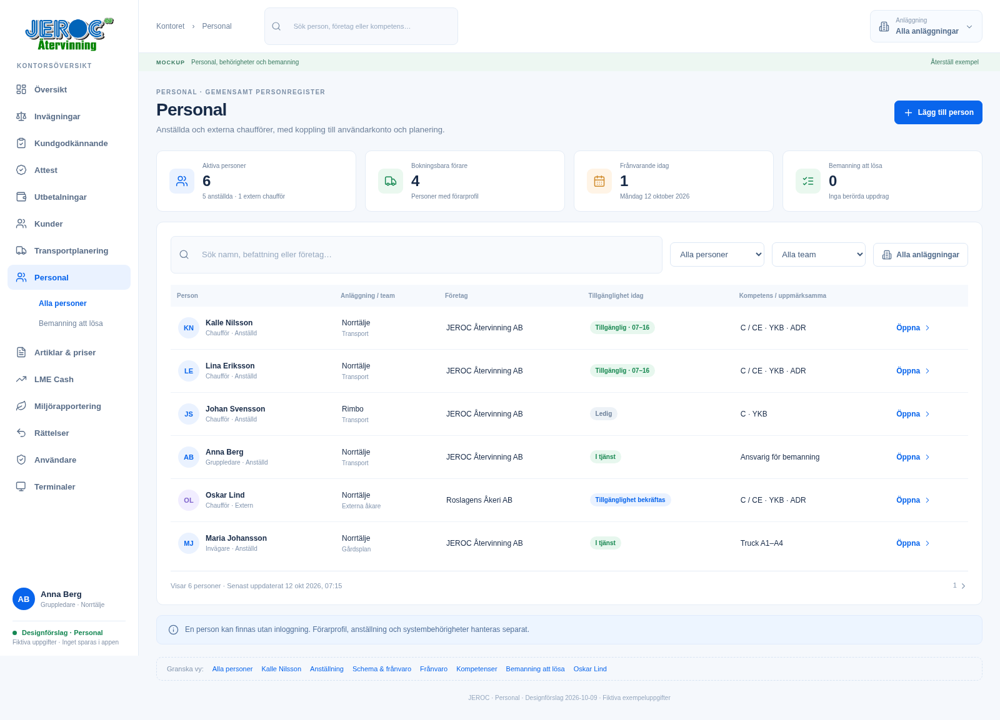
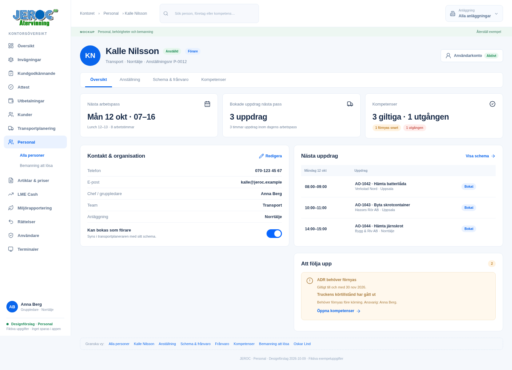
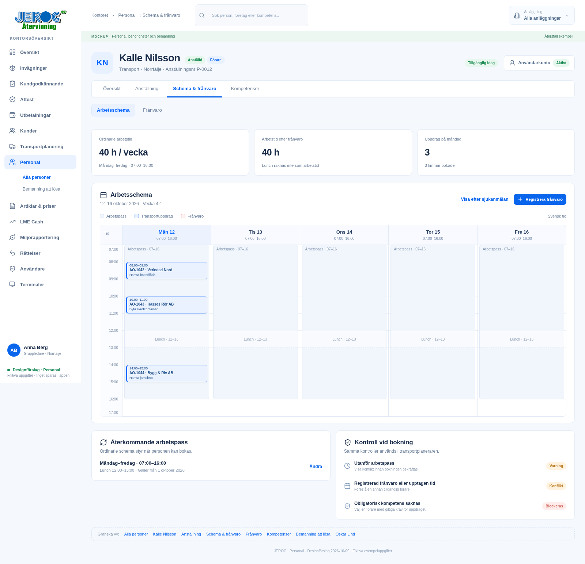
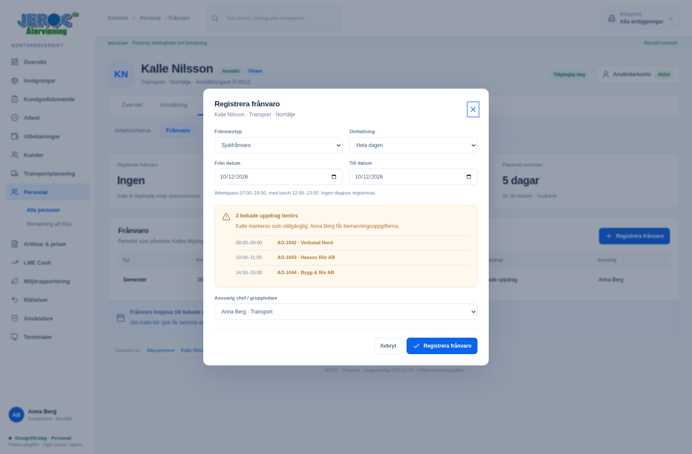
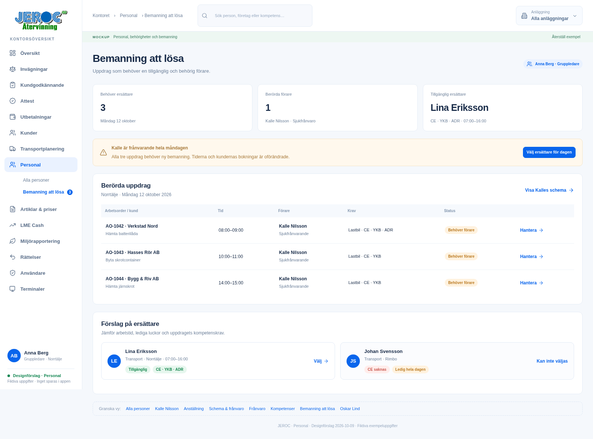
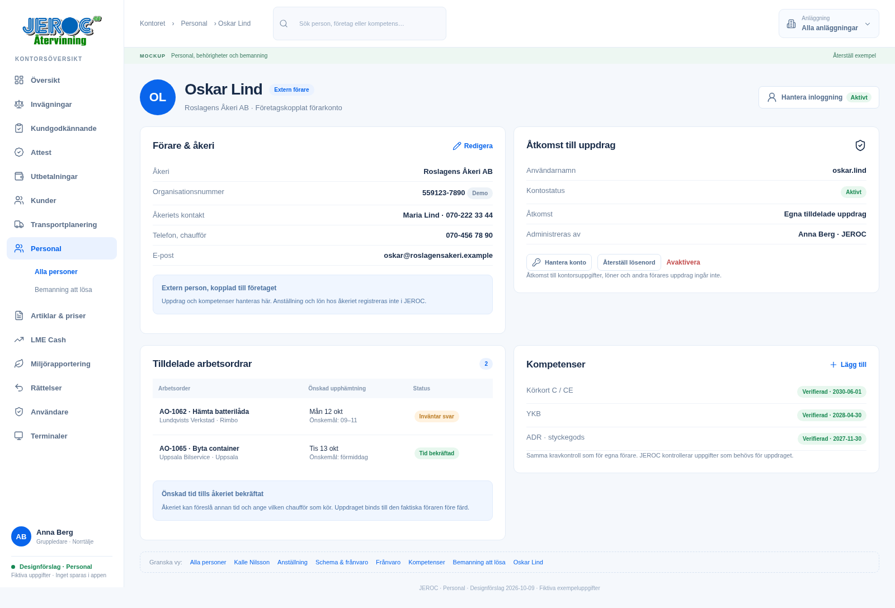

# Personal – JEROC-mockuper

Designförslag 2026-10-09 med fiktiva exempeluppgifter. Åtta huvudvyer och fyra
kompletterande bilder. Utseendet följer kontorets befintliga JEROC-design med
aktuell logga, blå knappar, vita kort och inloggad användare längst ner i menyn.

Detta är fristående mockuper. Produktionsappen, databasen och befintliga
behörigheter ändras inte. Inga konton, löner, frånvaroposter eller meddelanden
skapas i det riktiga systemet.

## Bilder

| Vy | Bild |
| --- | --- |
| 1. Personallista | [Öppna](01_Personallista.png) |
| 2. Personalkort, Översikt | [Öppna](02_Personalkort_Oversikt.png) |
| 3. Anställning och skyddad lön | [Öppna](03_Anstallning_Lon.png) |
| 4. Schema och tillgänglighet | [Öppna](04_Schema_Tillganglighet.png) |
| 5. Registrera frånvaro och se berörda uppdrag | [Öppna](05_Registrera_Franvaro.png) |
| 6. Kompetenser och fordonsbehörighet | [Öppna](06_Kompetenser_Fordon.png) |
| 7. Gruppledarens bemanningsuppgifter | [Öppna](07_Bemanning_Att_Losa.png) |
| 8. Extern chaufför och åkeri | [Öppna](08_Extern_Chauffor.png) |
| Välj ersättare | [Öppna](09_Valj_Ersattare.png) |
| Schema efter löst bemanning | [Öppna](10_Bemanning_Lost.png) |
| Administrera externt konto | [Öppna](11_Extern_Anvandarkonto.png) |
| Lön med HR-behörighet, exempel | [Öppna](12_Lon_Behorig_Vy.png) |

## Klickbar prototyp

[Ladda ner bilder och prototyp](JEROC_Personal_Mockuper.zip), packa upp och öppna
`index.html` i en webbläsare. Alla tillgångar finns i paketet; ingen installation
eller anslutning till JEROC krävs. GitHubs HTML-förhandsvisning kör inte prototypen.

Prova följande kedja:

1. Öppna **Kalle Nilsson** i personallistan.
2. Gå till **Schema & frånvaro** → **Frånvaro**.
3. Tryck **Registrera frånvaro**. Exemplet är sjukfrånvaro måndag 12 oktober 2026.
4. Förhandsvisningen visar tre berörda uppdrag. Bekräfta registreringen.
5. **Bemanning att lösa** visar tre uppgifter, med Anna Berg som ansvarig.
6. Välj ersättare. Lina är tillgänglig och har de obligatoriska kompetenserna.
   Johan är ledig och saknar CE; han kan inte väljas för dessa uppdrag.
7. Tilldela Lina och öppna schemat. Kalles frånvaro ligger kvar, uppdragen har
   fått ersättare och bemanningsvarningarna är lösta.

På **Oskar Lind** går det att öppna kontopanelen och visa aktivt/avaktiverat konto.
Lönefliken visar både begränsad åtkomst och ett separat designexempel med läsrätt.
Prototypens knapp för att visa HR-lön är en presentationskontroll, inte verklig
autentisering eller behörighetskontroll.

Huvudkedjan är klickbar med fasta exempeldata. Övriga redigeringsformulär visar
fält och tänkta åtgärder, utan generell validering eller datalagring. Ladda om eller
tryck **Återställ exempel** för att börja om. Det finns inga backendanrop.

## Implementerat i kontorsdemo 0.9.0

Personalvyerna har byggts in i befintliga JEROC med gemensam serverlagring:
[öppna Personal](https://jeroc-atervinning.onrender.com/kontor#/personnel).
Personalkort, anställning/skyddad lön, kompetenser, schema/frånvaro,
bemanningsuppgifter och externa chaufförskonton är funktionella. Extern
chaufförsinloggning finns på `/chauffor`.

Se [genomgång, rättigheter och begränsningar](../../personnel-demo.md).
Bilderna/prototypen ovan behålls som designunderlag. Implementerade vyer använder
verkliga demoposter och befintliga arbetsordrar. Nya exempeluppdrag heter
AO-1201–AO-1203 för att bevara tidigare AO-nummer.

## Gemensamma exempeluppgifter och regler

- Kalle Nilsson, anställd chaufför i Norrtälje, team Transport. Chef/gruppledare
  Anna Berg. Anställd från 2023-04-03. Person och användarkonto kopplas via stabila ID:n.
- Arbetspass måndag–fredag 07–16, obetald lunch 12–13: 40 timmar per vecka.
  Frånvaro påverkar tillgängligheten; bokningar tas inte bort automatiskt.
- AO-1042: Verkstad Nord, 08–09. AO-1043: Hasses Rör AB, 10–11.
  AO-1044: Bygg & Riv AB, 14–15. Alla tre tider och kunder behålls vid förarbyte.
- Förarbyte kräver kontroll av arbetstid, frånvaro, överlappande uppdrag, fordon
  och tillämpliga obligatoriska kompetenser för uppdragets datum. Restid ingår i
  kommande transportplanering; mockupen räknar inte rutter.
- YKB, körkort, ADR och arbetsgivarens körtillstånd hålls som separata kompetenser.
  Farligt avfall innebär inte automatiskt ADR-krav; kraven i exemplet är valda
  uppdragskrav och ska bedömas utifrån faktisk transport vid implementation.
- Oskar Lind tillhör Roslagens Åkeri AB. Ingen anställning/lön hos åkeriet lagras
  i JEROC. Externt konto ser bara tilldelade uppdrag inom sin företagskoppling.
  Önskad upphämtningstid är ett önskemål fram till bekräftad planering.
- Konto, befattning, förarprofil och kompetens är skilda begrepp. HR-rättigheter
  för lön och känsliga uppgifter behöver egna kontroller på servern vid byggstart.
- Utrustning, dokument, profilfoto, historikvy, rekrytering, löneutbetalning och
  externa integrationer ligger utanför detta mockupuppdrag.

## Implementation efter designgranskning

Återanvänd befintlig PostgreSQL, anläggningsregister, kontomodell och
transportplanerare. Personprofiler ska kopplas till befintliga användar- och
förar-ID:n, så tidigare bokningar och spårbarhet bevaras. De nya vyerna bör ligga i
en egen personalmodul. Frånvaro och bemanningsuppgifter behöver gemensam
serverlagring och rättighetskontroll. Befintlig demoidentitet ska inte användas
som skydd för riktiga löner eller andra känsliga personaluppgifter.

För utvecklare: `node docs/mockups/personal/render-mockups.mjs` exporterar bilderna
med befintlig Playwright-installation. Den startar en separat lokal filserver och
kontaktar inte appen. Den kontrollerar bemanningskedjan, kontoexemplet,
JavaScript-fel och layoutöverflöde.

## Förhandsvisning

